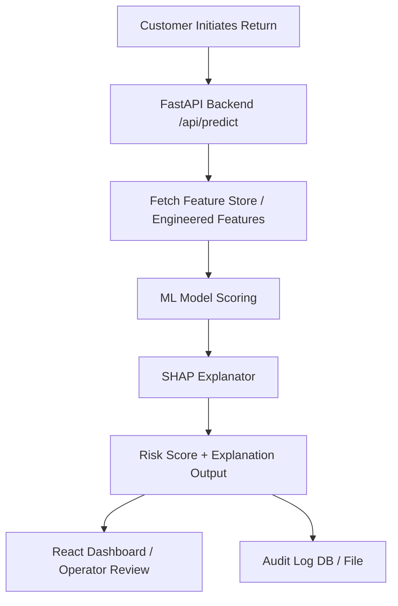

# ReturnShield AI Architecture

This document describes the technical architecture and design decisions for ReturnShield AI.

## System Workflow



1. **Transaction / Return Event**: An API client initiates a return request containing purchase details and customer ID.
2. **Feature Retrieval**: The system pulls or computes relevant features (e.g., customer return frequency, payment history anomalies, chargeback flags).
3. **Inference**: The pre-trained ML model generates a probability score (0.0 to 1.0) indicating return abuse risk.
4. **Explanation**: SHAP (SHapley Additive exPlanations) values are generated for the transaction to explain which features contributed to the decision.
5. **Action / Logging**: The backend returns the score and explanations, logs the decision to the audit trail, and renders the result in the React Dashboard for operator audit.

---

## Data Schema & Features

To train the model, a synthetic dataset will be generated containing:
* **Customer Profile**: Account age, historical purchase count, total lifetime value (LTV).
* **Payment/Razorpay Mock Features**: Historical payment failure count, number of chargebacks, card validation status.
* **Return Behavior**: Historical return count, fraction of items returned, average return delay (days).
* **Current Order Features**: Order value, number of items, category risk profile, return reason code.

---

## Cost-Benefit & Decision Policy

A simple probability threshold of `0.5` is often sub-optimal. The decision policy will evaluate:
* **Cost of False Positive (FP)**: Offending a loyal customer by blocking a legitimate return (loss of future LTV).
* **Cost of False Negative (FN)**: Accepting an abusive return (loss of item cost + shipping/handling fees).

The decision threshold \( \theta \) is set to minimize:
\[
\text{Total Cost} = C_{FP} \cdot N_{FP} + C_{FN} \cdot N_{FN}
\]

---

## Directory Structure

```text
returnshield-ai/
├── docs/
│   └── ARCHITECTURE.md          # Architecture & technical design
├── src/
│   ├── api/                     # FastAPI backend application
│   ├── data/                    # Synthetic data generation and preprocessing
│   ├── features/                # Feature engineering modules
│   ├── model/                   # ML training, prediction, and SHAP explanation
│   └── __init__.py
├── tests/                       # Unit tests
├── .gitignore                   # Project git ignore list
├── requirements.txt             # Python dependencies
└── README.md                    # Project overview
```
